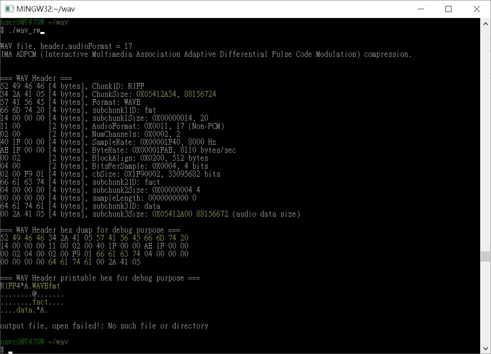

# wav_non-PCM
wave file, specifc MP3 recording, non-PCM format, try to understand what_is_IMA_ADPCM

  

### how to build exe
C/C++ compiler, i.e. minGW, win10, 'make clean' or 'make'  
[wav_rw.exe](wav_rw.exe) will be produced, or download here(wav_rw.exe)  

### how to uses
double click wav_rw.exe
it will reads /inputs/1-trimmed.wav, parse and display wave Header  
written /outputs/test.wav  

1-trimmed.wav is trimmed wave file, just part of header of MP3 recording.  
/doc/, references of wave file specification.  


### Q&A   
```
52 49 46 46 34 2A 41 05 57 41 56 45 66 6D 74 20
14 00 00 00 11 00 02 00 40 1F 00 00 AE 1F 00 00
00 02 04 00 02 00 F9 01 66 61 63 74 04 00 00 00
00 00 00 00 64 61 74 61 00 2A 41 05

以上是一個 wave 檔案的開頭, 代表什麼資訊
```

### Answer by deepseek and chatgpt, 大致可以, 但計算錯誤
```
這是一個 WAVE 音訊檔案的開頭部分，包含 RIFF 檔案結構和基本的格式資訊。以下是對這些十六進位數據的解讀：

1. **RIFF 標頭 (0-3 bytes)**
   - `52 49 46 46` = "RIFF" (檔案格式標識)

2. **檔案大小 (4-7 bytes)**
   - `34 2A 41 05` = 0x05412A34 (小端序) = 88,308,276 bytes (約 84.2 MB)

3. **檔案類型 (8-11 bytes)**
   - `57 41 56 45` = "WAVE" (表示是 WAVE 格式)

4. **fmt 子塊 (12-15 bytes)**
   - `66 6D 74 20` = "fmt " (格式標記)
   - `14 00 00 00` = 0x14 = 20 bytes (fmt 子塊大小)

5. **音訊格式資訊 (16-35 bytes)**
   - `11 00` = 0x11 = WAVE_FORMAT_IMA_ADPCM (壓縮格式)
   - `02 00` = 2 個聲道 (立體聲)
   - `40 1F 00 00` = 0x1F40 = 8000 Hz (採樣率)
   - `AE 1F 00 00` = 0x1FAE = 8106 bytes/秒 (位元組速率)
   - `00 02` = 2 位元組/區塊對齊
   - `04 00` = 4 位/樣本
   - `02 00` = 額外的格式資訊大小 (2 bytes)
   - `F9 01` = IMA ADPCM 特定參數

6. **fact 子塊 (36-43 bytes)**
   - `66 61 63 74` = "fact"
   - `04 00 00 00` = 4 bytes (fact 子塊大小)
   - `00 00 00 00` = 樣本數 (可能後續填充)

7. **data 子塊 (44-47 bytes)**
   - `64 61 74 61` = "data"
   - `00 2A 41 05` = 0x05412A00 = 88,308,224 bytes (音訊數據大小)

這是一個採用 IMA ADPCM 壓縮的立體聲 WAVE 檔案，採樣率 8000 Hz，檔案總大小約 84.2 MB，其中音訊數據部分佔約 84.2 MB。這種格式常見於遊戲音效或需要壓縮的語音應用。
```

### 錯誤包括

```
2. **檔案大小 (4-7 bytes)**
   - `34 2A 41 05` = 0x05412A34 (小端序) = 88,308,276 bytes (約 84.2 MB)

   - `00 2A 41 05` = 0x05412A00 = 88,308,224 bytes (音訊數據大小)
```


previous attemps to deal with WAV file, it was standard PCM file and structure.
https://github.com/xiaolaba/IR-remote-control-code/tree/master/audio-jack-IR-remote/generator
